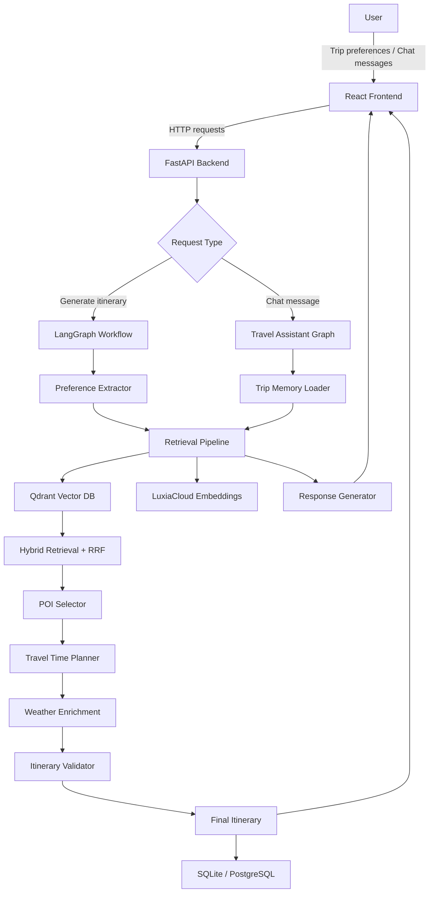
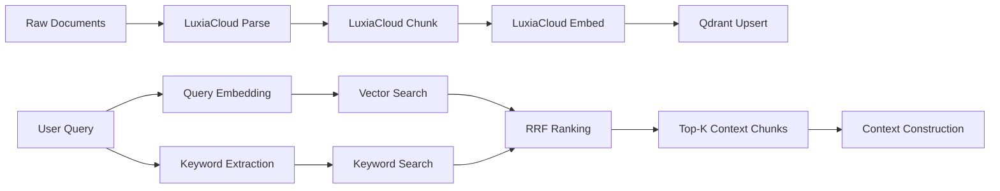
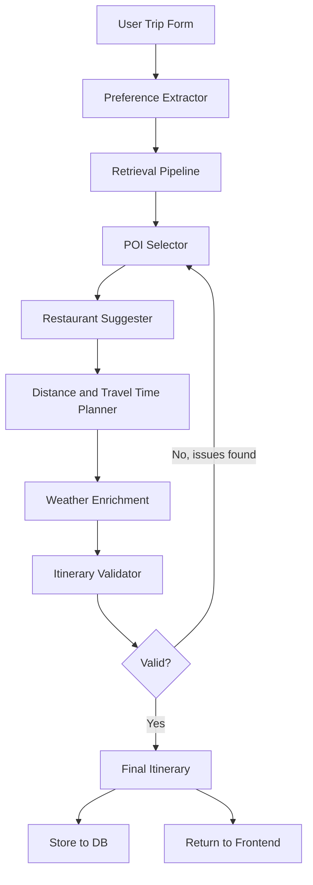

# ✈️ Ai-tinerary

**An AI-powered travel itinerary planner with a conversational travel assistant.**

Ai-tinerary generates full day-by-day travel itineraries from a user's trip preferences, then lets the user refine, question, and modify the plan through a chat interface — all grounded in retrieved travel knowledge rather than model memorisation.

> Built as a university capstone project by a team of five. The system covers travel destinations across Malaysia and Indonesia.

---

## Table of Contents

- [Motivation](#motivation)
- [Features](#features)
- [Screenshots](#screenshots)
- [System Architecture](#system-architecture)
- [Retrieval Pipeline](#retrieval-pipeline)
- [Itinerary Generation Pipeline](#itinerary-generation-pipeline)
- [Conversational Travel Assistant](#conversational-travel-assistant)
- [Why Hybrid Retrieval and RRF](#why-hybrid-retrieval-and-rrf)
- [Tech Stack](#tech-stack)
- [Repository Structure](#repository-structure)
- [Installation](#installation)
- [Example Usage](#example-usage)
- [Challenges Encountered](#challenges-encountered)
- [Future Improvements](#future-improvements)
- [Team](#team)
- [Acknowledgements](#acknowledgements)

---

## Motivation

Planning a trip is harder than it looks. Most people end up stitching together information from five different tabs — TripAdvisor for places, Google Maps for distances, weather apps for packing, Reddit for local tips, and some blog post from 2019 for restaurant recommendations. By the time you have a coherent plan, half a day is gone.

Existing itinerary tools tend to fall into two camps. Rule-based generators (pick 3 attractions per day, done) produce technically valid but impersonal plans that ignore travel time, opening hours, or what the user actually cares about. Purely LLM-based approaches are more flexible, but models hallucinate place names, invent opening hours, and confidently suggest restaurants that closed years ago.

We built Ai-tinerary to sit between those two approaches:

- **Retrieval-Augmented Generation (RAG)** grounds the planner in real travel documents — Wikivoyage exports, tourism board guides, city-level travel information — rather than relying on what a language model happens to remember about a destination.
- **Conversational refinement** lets users push back on the generated plan without starting over. "Can we swap Day 2 evening for something quieter?" is a natural thing to ask a travel agent; it should work the same way here.
- **LangGraph orchestration** structures the planning as a proper multi-step workflow — preference extraction, retrieval, POI selection, travel time estimation, weather enrichment, validation — rather than a single monolithic prompt.

The target coverage for this version is Malaysia (all 13 states + federal territories) and Indonesia (Bali, Jakarta).

---

## Features

| Feature | Description |
|---|---|
| 🗺️ AI Itinerary Generation | Generates a structured day-by-day itinerary from user input |
| 💬 Travel Assistant Chatbot | Conversational assistant that can explain, revise, and extend the itinerary |
| 🔍 Retrieval-Augmented Generation | Itinerary content is grounded in retrieved travel documents, not model memory |
| 🌤️ Weather Enrichment | Attaches weather context to itinerary days based on destination and dates |
| 🚗 Transportation Planning | Estimates travel times between POIs and accounts for routing logic |
| 🧠 Trip Memory | Stores the generated itinerary and user preferences for use in follow-up chat |
| 📄 PDF Export | Exports the final itinerary as a downloadable PDF |
| 🔐 Authentication | User accounts with login/register, tied to stored trips |
| 📋 Itinerary Management | Users can view, update, or delete past trips |

---

## Screenshots

> Screenshots will be added once the application is deployed. Placeholders show the intended layout.

**Trip Creation Form**

*User inputs destination, cities, travel dates, travel style, and preferences before generation.*

**Generated Itinerary View**

*Day-by-day itinerary with POIs, estimated travel times, meal suggestions, and weather notes.*

**Travel Assistant Chat**

*Conversational assistant grounded in the user's itinerary and retrieved destination knowledge.*

**PDF Export**

*Downloadable itinerary PDF formatted for offline use.*

---

## System Architecture

The system is split into two services — a React frontend and a FastAPI backend — connected over HTTP. The backend runs a LangGraph workflow for itinerary generation and hosts the conversational assistant.



---

## Retrieval Pipeline

Rather than relying on model memory for travel facts, the system builds a retrieval index from curated travel documents and queries it at generation time.

### Data Sources

The knowledge base contains:
- **Wikivoyage exports** — community-maintained travel articles with POIs, tips, and neighbourhood descriptions
- **Tourism board documents** — official destination guides for Malaysian states and Indonesian cities
- **Country and city travel guides** — structured information on transport, customs, and logistics

Coverage: all 13 Malaysian states plus Putrajaya, Labuan, and Wilayah Persekutuan; Bali and Jakarta for Indonesia.

### Pipeline Steps



**1. Document Collection** — Travel documents are collected per destination and tagged with country, state/city, and content type metadata.

**2. Parsing** — LuxiaCloud Parse handles structure extraction from PDFs and markdown travel documents, producing clean text with preserved structure.

**3. Chunking** — LuxiaCloud Chunk splits documents into overlapping text chunks sized for embedding. Chunk boundaries are paragraph-aware to avoid cutting mid-sentence on a POI description.

**4. Embedding Generation** — LuxiaCloud's embedding API converts chunks to dense vectors. Using a managed embedding service rather than a self-hosted model kept the pipeline simple during development.

**5. Vector Storage** — Qdrant stores the chunk vectors with metadata payloads (destination, source, chunk type). Qdrant was chosen because it's open source, easy to run locally, and has first-class support for hybrid retrieval.

**6. Hybrid Retrieval** — At query time, the system runs both vector search (semantic similarity) and keyword search (BM25-style) in parallel.

**7. RRF Ranking** — Results from both search paths are merged using Reciprocal Rank Fusion. Each result's final score is based on its rank across both lists, not raw similarity scores.

**8. Context Construction** — Top-K chunks are assembled into a structured context block passed to the LLM along with the generation prompt.

---

## Itinerary Generation Pipeline

Once retrieval context is ready, itinerary generation runs as a LangGraph stateful workflow. Each node has a specific job, and the state is passed forward through the graph.



**Step 1 — Preference Extraction:** The raw form input (destination, dates, travel style, interests) is parsed into a structured preference object used to guide POI selection and retrieval.

**Step 2 — Retrieval:** The hybrid pipeline queries Qdrant for relevant chunks based on the destination cities and user interests.

**Step 3 — POI Selection:** Retrieved context is used to select appropriate points of interest for each day. Selection accounts for category balance (cultural, nature, food, leisure) based on travel style.

**Step 4 — Travel Time Planning:** POIs are ordered within each day to minimise unnecessary backtracking. Estimated travel times between locations are attached based on distance proxies and transport mode.

**Step 5 — Weather Enrichment:** Weather context for the destination and travel period is fetched and attached to relevant itinerary days (e.g., flagging outdoor activities on potentially rainy days).

**Step 6 — Restaurant Suggestions:** Meal slots are filled with restaurant suggestions appropriate to the destination and user preference (budget, cuisine type).

**Step 7 — Validation:** The validator checks for common issues — duplicate locations, same-day scheduling conflicts, unrealistic travel times, missing time blocks. If issues are found, the relevant step is re-run.

**Step 8 — Final Itinerary:** A clean, structured itinerary is returned to the frontend and persisted to the database tied to the user's account.

---

## Conversational Travel Assistant

After an itinerary is generated, users can chat with an AI travel assistant that knows about their specific trip.

### How It Works

**Trip Memory** — When a user opens the chat interface for a trip, the stored itinerary and preference profile are loaded from the database and injected into the assistant's context. The assistant knows which cities the user is visiting, for how long, and in what order.

**Retrieval Reuse** — The same hybrid retrieval pipeline used during generation is also available during chat. If a user asks about a specific place ("what's the best time to visit Batu Caves?"), the assistant queries Qdrant for relevant context before responding.

**Itinerary Modification** — Users can ask the assistant to modify the itinerary in natural language. The assistant interprets the request, makes the change, and writes the updated itinerary back to the database. Changes are reflected in the itinerary view without regenerating the entire plan.

**Conversation History** — The full conversation is maintained within the session so the assistant can refer back to earlier exchanges ("like I mentioned earlier, I prefer evenings indoors").

---

## Why Hybrid Retrieval and RRF

This is one of the more deliberate technical decisions in the project, so it's worth explaining properly.

### The Problem with Vector Search Alone

Vector search works well for semantic similarity — "temples in Penang" will surface chunks about George Town's religious sites even if they don't use that exact phrase. But it can underperform on exact entity matching. If a user's preferences mention "Petronas Twin Towers" specifically, a purely vector-based search might rank a generic Kuala Lumpur overview above a chunk that directly describes the towers, because the semantic distance between a KL overview and a specific landmark query can be small.

### The Problem with Keyword Search Alone

BM25-style keyword search reliably retrieves documents containing exact terms, but it has no understanding of semantic equivalence. A chunk about "Menara Kembar Petronas" (the Malay name) won't surface for the query "Petronas Twin Towers" unless there's explicit synonym handling.

### Why Hybrid Retrieval

Running both search types in parallel and combining results captures the strengths of each. Semantic search handles conceptual queries; keyword search handles named entity precision.

### Why RRF Instead of Score Fusion

Combining vector similarity scores with BM25 scores directly requires normalisation and weight tuning — two parameters that are highly dataset-dependent and annoying to calibrate. RRF sidesteps this entirely by working on rank positions, not raw scores. A result that ranks highly in both retrieval paths gets a high combined RRF score regardless of the absolute score magnitudes. It's not perfect — it treats a rank-1 result the same whether it was a strong or marginal first-place — but for this project's scale it performed well without any manual tuning.

### Trade-offs

- RRF doesn't preserve the margin information between ranks, so a retriever that found a very strong match and a weak match will treat them the same distance apart as two moderate matches.
- Running two search paths doubles the number of Qdrant queries per request.
- For very small datasets (a single city), keyword and vector results tend to overlap heavily, reducing the benefit of fusion.

For a travel RAG system at this scale, the simplicity and calibration-free nature of RRF outweighed these limitations.

---

## Tech Stack

| Layer | Technology | Reason |
|---|---|---|
| Frontend Framework | React + TypeScript | Component-based UI, type safety |
| Frontend Build Tool | Vite | Fast development server, modern bundling |
| Styling | TailwindCSS | Utility-first, consistent design without a heavy component library |
| Backend Framework | FastAPI | Async support, automatic OpenAPI docs, clean routing |
| Workflow Orchestration | LangGraph | Stateful multi-step AI workflow with branching and cycles |
| Vector Database | Qdrant | Open source, local deployment, native hybrid retrieval |
| Embedding + Parsing | LuxiaCloud | Managed embedding and document processing pipeline |
| Retrieval Strategy | Hybrid (Vector + Keyword) + RRF | Better coverage than either approach alone |
| Database | SQLite (dev) / PostgreSQL (prod) | User data, trips, itineraries, conversation history |
| Authentication | JWT-based auth | Stateless, easy to integrate with FastAPI |
| PDF Export | Python PDF library | Server-side itinerary export |

---

## Repository Structure

```
Ai-tinerary/
├── README.md
├── .gitignore
│
├── AI-tinerary-frontend/
│   ├── src/
│   │   ├── components/
│   │   │   ├── TripForm/          # Trip creation interface
│   │   │   ├── ItineraryView/     # Day-by-day itinerary display
│   │   │   ├── ChatInterface/     # Travel assistant chat UI
│   │   │   └── Auth/              # Login and registration
│   │   ├── pages/
│   │   ├── hooks/
│   │   ├── lib/
│   │   │   └── api.ts             # Backend API calls
│   │   └── main.tsx
│   ├── public/
│   ├── index.html
│   ├── tailwind.config.ts
│   ├── vite.config.ts
│   └── package.json
│
└── Ai-tinerary-backend/
    ├── app/
    │   ├── api/
    │   │   └── routes.py           # FastAPI route handlers
    │   ├── orchestrator/
    │   │   ├── langgraph_workflow.py   # Itinerary generation graph
    │   │   └── chat_graph.py          # Conversational assistant graph
    │   ├── planning/
    │   │   ├── preference_extractor.py
    │   │   ├── poi_selector.py
    │   │   ├── distance_planner.py
    │   │   ├── travel_time.py
    │   │   ├── weather_enrichment.py
    │   │   ├── restaurant_suggester.py
    │   │   └── validator.py
    │   ├── retrieval/
    │   │   ├── pipeline.py         # Hybrid retrieval + RRF
    │   │   ├── qdrant_client.py
    │   │   └── embeddings.py
    │   ├── models/
    │   │   └── schemas.py          # Pydantic models
    │   ├── db/
    │   │   └── crud.py             # Database operations
    │   └── export/
    │       └── pdf_exporter.py
    ├── data/
    │   ├── malaysia/               # Per-state travel documents
    │   └── indonesia/              # Bali, Jakarta
    ├── main.py
    ├── requirements.txt
    └── .env.sample
```

---

## Installation

### Prerequisites

- Node.js 18+
- Python 3.10+
- Qdrant (local Docker instance or Qdrant Cloud)
- LuxiaCloud API key

### 1. Clone the Repository

```bash
git clone https://github.com/aimeano/Ai-tinerary.git
cd Ai-tinerary
```

### 2. Backend Setup

```bash
cd Ai-tinerary-backend
python -m venv venv
source venv/bin/activate        # Windows: venv\Scripts\activate
pip install -r requirements.txt
```

Copy the environment file and fill in your values:

```bash
cp .env.sample .env
```

`.env` variables:

```env
# LuxiaCloud
LUXIACLOUD_API_KEY=your_key_here

# Qdrant
QDRANT_URL=http://localhost:6333
QDRANT_COLLECTION=aitinerary

# Auth
SECRET_KEY=your_jwt_secret
ALGORITHM=HS256
ACCESS_TOKEN_EXPIRE_MINUTES=60

# Database
DATABASE_URL=sqlite:///./aitinerary.db

# Weather API
WEATHER_API_KEY=your_key_here
```

### 3. Start Qdrant (Docker)

```bash
docker run -p 6333:6333 qdrant/qdrant
```

### 4. Index Travel Documents

```bash
python scripts/index_documents.py
```

This will parse, chunk, embed, and upload all documents in `data/` to Qdrant.

### 5. Run the Backend

```bash
uvicorn main:app --reload --port 8000
```

API docs available at `http://localhost:8000/docs`.

### 6. Frontend Setup

```bash
cd ../AI-tinerary-frontend
npm install
```

Create a `.env.local` file:

```env
VITE_API_URL=http://localhost:8000
```

```bash
npm run dev
```

Frontend runs at `http://localhost:5173`.

---

## Example Usage

### 1. Create a Trip

Fill in the trip form with:
- **Destination:** Malaysia
- **Cities:** Kuala Lumpur, Penang
- **Travel Dates:** 10 days
- **Travel Style:** Cultural + Food
- **Interests:** Heritage sites, local markets, street food

### 2. Generate Itinerary

The system will:
1. Extract your preferences
2. Retrieve relevant travel context from Qdrant
3. Select and sequence POIs
4. Attach travel times and weather notes
5. Validate and return a structured day-by-day plan

### 3. Chat with the Travel Assistant

Example questions the assistant handles:

```
"Can you swap the Batu Caves visit to the morning instead?"

"What should I know about getting from KL to Penang?"

"Is Jalan Alor night market worth going to on a weekday?"

"Add a half-day in Penang Hill, somewhere on Day 6."
```

### 4. Export Itinerary

Click **Export PDF** from the itinerary view. A formatted PDF with the full day-by-day plan will download to your device.

---

## Challenges Encountered

**Retrieval Quality on Sparse Destinations**
Some Malaysian states have significantly less Wikivoyage coverage than others. For those, retrieval returns fewer high-quality chunks, and the LLM has to fill gaps from memory — which reintroduces the hallucination risk we were trying to avoid. Adding more local tourism board documents helped, but this is an ongoing data coverage problem.

**Duplicate POIs Across Chunks**
The same landmark can appear in multiple chunks from different documents (e.g., Petronas Twin Towers mentioned in a Kuala Lumpur city guide and a Malaysia country overview). Without deduplication, early versions of the itinerary would list the same location twice on different days. The validator catches explicit duplicates but subtler cases (two differently-named entrances to the same complex) are harder to detect.

**Travel Time Estimation**
Without a live maps API, travel time between POIs is estimated using approximate coordinates and transport mode assumptions. This works reasonably well within city centres but produces poor estimates for cross-city legs where tolls, traffic patterns, and transport options matter significantly.

**Itinerary Consistency After Chat Edits**
When a user modifies the itinerary through chat, keeping the rest of the plan internally consistent is difficult. Swapping a museum visit on Day 3 might create a travel time conflict if the new location is far from Day 3's next POI. The current approach re-validates after modifications but doesn't always catch cascading timing issues.

**LLM Hallucinations on Local Details**
Opening hours, ticket prices, and seasonal availability are the most common hallucination targets. The retrieval grounding reduces this substantially compared to a direct prompt, but it doesn't eliminate it — particularly for less-documented restaurants and small local attractions.

**RRF with Imbalanced Result Counts**
When one retrieval path returns far more results than the other (vector search returned 20 chunks, keyword search returned 3), RRF can be dominated by the larger pool. We apply a result count cap to both paths before fusion to keep the merge more balanced.

---

## Future Improvements

- **Reranking** — Adding a cross-encoder reranker after RRF to improve the final context ordering. Cohere Rerank or a local cross-encoder model would both work.
- **Multi-agent architecture** — Breaking the LangGraph workflow into specialised agents (retrieval agent, planning agent, validation agent) that collaborate rather than running in a fixed sequence.
- **Hotel and flight integration** — Connecting to booking APIs to suggest accommodations and surface flight options between cities within the trip.
- **Live event integration** — Pulling in local events, festivals, and seasonal activities from public event APIs to make itineraries more timely.
- **Dynamic replanning** — If a user reports that a location was closed or they ran out of time, the assistant should be able to replan the remainder of the day dynamically.
- **Larger destination coverage** — Extending the knowledge base beyond Malaysia and Indonesia to cover Southeast Asia more broadly.
- **User feedback loop** — Collecting explicit ratings on itinerary quality to identify systematic weaknesses in POI selection or retrieval for specific destinations.

---

## Team

This project was completed as a collaborative team effort by:

- **Muhammad Syahrul Aiman**
- **Nur Ain Salsabila**
- **Balqis**
- **Shannon Nathania Susilo**
- **Nurnisa Humaira**

The team collectively contributed to the planning, implementation, testing, and documentation of the project.

---

## Acknowledgements

- [React](https://react.dev/) — Frontend framework
- [FastAPI](https://fastapi.tiangolo.com/) — Backend framework
- [LangGraph](https://langchain-ai.github.io/langgraph/) — AI workflow orchestration
- [Qdrant](https://qdrant.tech/) — Vector database
- [LuxiaCloud](https://luxia.cloud/) — Document parsing, chunking, and embeddings
- [Wikivoyage](https://en.wikivoyage.org/) — Open travel knowledge base (CC BY-SA)