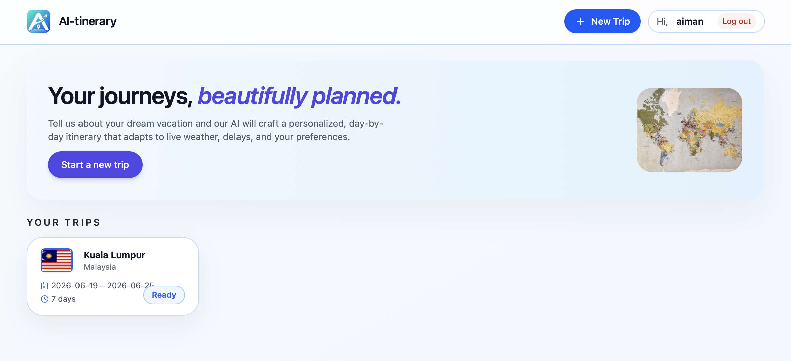
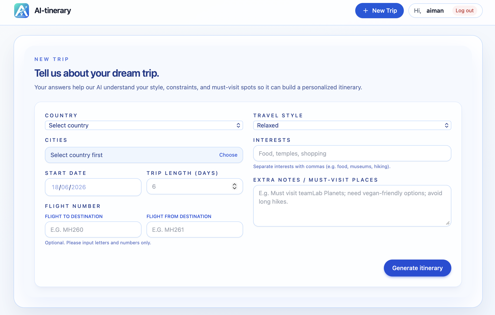
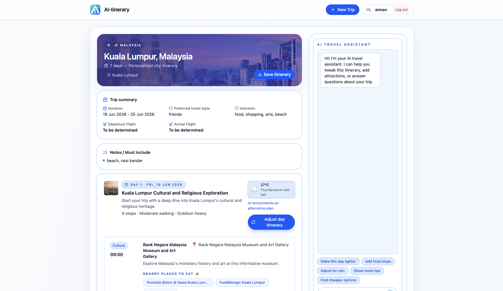
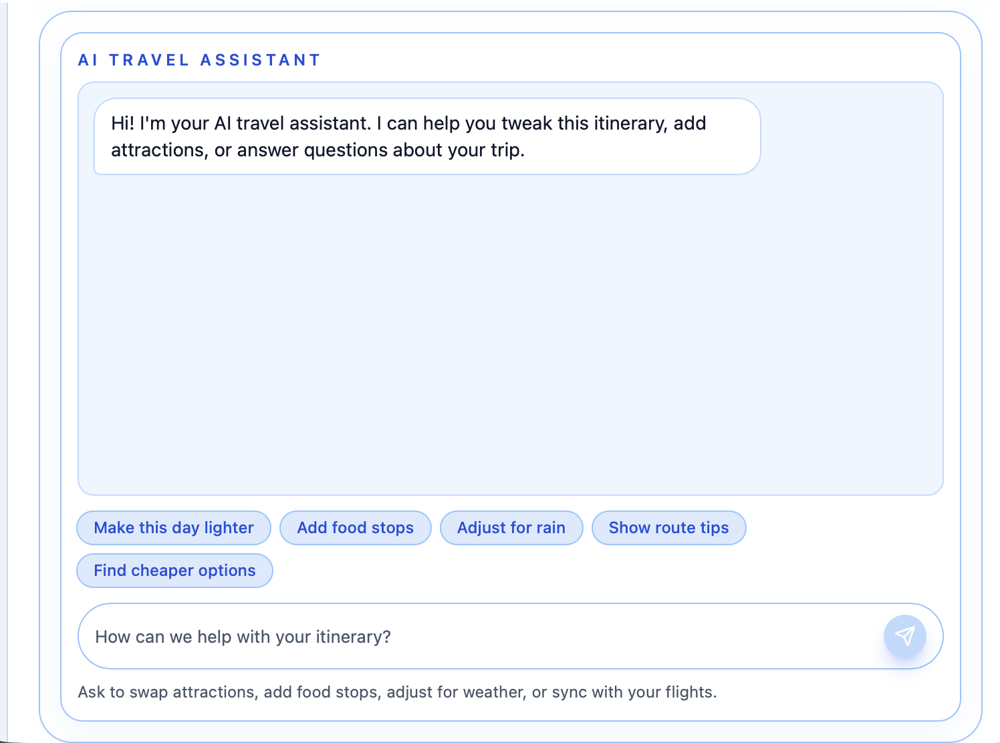
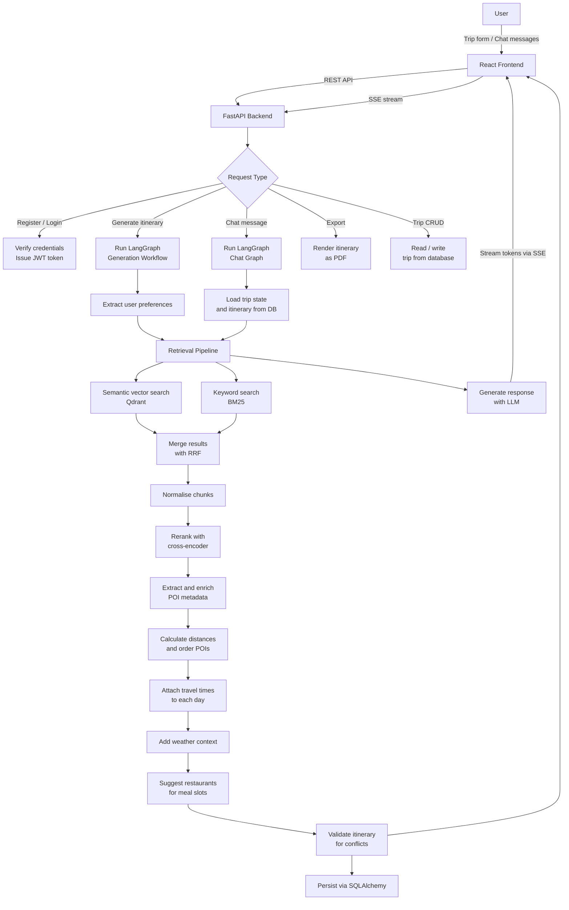
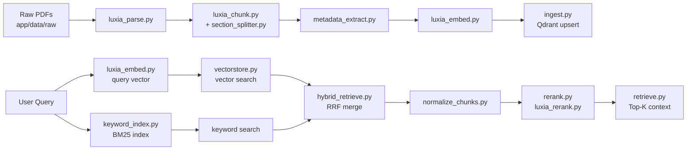
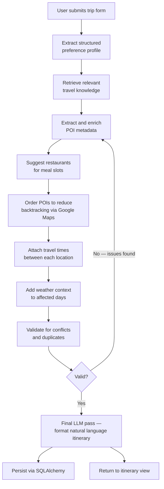

# ✈️ Ai-tinerary


**An AI-powered travel itinerary planner with a conversational travel assistant.**

Ai-tinerary generates full day-by-day travel itineraries from a user's trip preferences, then lets the user refine, question, and modify the plan through a chat interface — all grounded in retrieved travel knowledge rather than model memorisation.

> Built as a university capstone project by a team of five. The system covers travel destinations across Malaysia and Indonesia.

---

## Table of Contents

- [Motivation](#motivation)
- [Features](#features)
- [Screenshots](#screenshots)
- [System Architecture](#system-architecture)
- [Knowledge Base](#knowledge-base)
- [Retrieval Pipeline](#retrieval-pipeline)
- [Itinerary Generation Pipeline](#itinerary-generation-pipeline)
- [Conversational Travel Assistant](#conversational-travel-assistant)
- [Why Hybrid Retrieval and RRF](#why-hybrid-retrieval-and-rrf)
- [Tech Stack](#tech-stack)
- [Repository Structure](#repository-structure)
- [Installation](#installation)
- [Example Usage](#example-usage)
- [Challenges Encountered](#challenges-encountered)
- [Future Improvements](#future-improvements)
- [Team](#team)
- [Acknowledgements](#acknowledgements)

---

## Motivation

Planning a trip is harder than it looks. Most people end up stitching together information from five different tabs — TripAdvisor for places, Google Maps for distances, a weather app for packing, Reddit for local tips, and some blog post from 2019 for restaurant recommendations. By the time you have a coherent plan, half a day is gone.

Existing itinerary tools tend to fall into two camps. Rule-based generators (pick 3 attractions per day, done) produce technically valid but impersonal plans that ignore travel time, opening hours, or what the user actually cares about. Purely LLM-based approaches are more flexible, but models hallucinate place names, invent opening hours, and confidently recommend restaurants that no longer exist.

We built Ai-tinerary to sit between those two approaches:

- **Retrieval-Augmented Generation (RAG)** grounds the planner in real travel documents — Wikivoyage exports, tourism board guides, mixed destination content — rather than relying on whatever a language model happens to remember about a destination.
- **Conversational refinement** lets users push back on the generated plan without starting over. "Can we swap Day 2 evening for something quieter?" is a natural thing to ask a travel agent; it should work the same way here.
- **LangGraph orchestration** structures planning as a proper multi-step workflow — preference extraction, retrieval, POI selection, travel time estimation, weather enrichment, validation — rather than one monolithic prompt that tries to do everything at once.

The target coverage for this version is Malaysia (all 13 states + federal territories) and Indonesia (Bali, Jakarta).

---

## Features

| Feature | Description |
|---|---|
| 🗺️ AI Itinerary Generation | Generates a structured day-by-day itinerary from user trip preferences |
| 💬 Travel Assistant Chatbot | Conversational assistant streamed via SSE that can explain, revise, and extend the itinerary |
| 🔍 Retrieval-Augmented Generation | Itinerary content grounded in retrieved travel documents via hybrid search + reranking |
| 🌤️ Weather Enrichment | Attaches weather context to itinerary days based on destination and travel dates |
| 🚗 Transportation Planning | Google Maps-based distance and travel time estimation between POIs |
| ✈️ Flight Data | Live flight information via Airlabs API |
| 🧠 Trip Memory | Persists trip state and itinerary for use throughout the chat session |
| 📄 PDF Export | Server-side itinerary export as a downloadable PDF |
| 🔐 Authentication | JWT-based user accounts with login and registration |
| 📋 Itinerary Management | Users can view, update, and delete past trips |

---

## Screenshots

> Screenshots will be added once the application is deployed.

**Home Page**

*Landing page showing available destinations — Malaysia and Indonesia.*

**Trip Creation**

*User inputs destination, cities, travel dates, travel style, and preferences.*

**Generated Itinerary View**

*Day-by-day itinerary with activity cards, transport options, travel times, and weather notes.*

**Travel Assistant Chat**

*Streamed conversational assistant grounded in the user's itinerary and retrieved destination knowledge.*

---

## System Architecture

The system is two services — a React/TypeScript frontend and a FastAPI backend — communicating over REST and Server-Sent Events (SSE). The backend handles JWT authentication, trip persistence via SQLAlchemy (SQLite for local development, PostgreSQL in production), LangGraph workflow orchestration, and the Qdrant-backed retrieval pipeline.



---

## Knowledge Base

The retrieval index is built from a curated set of travel documents covering Malaysia and Indonesia. Documents live in `app/data/` and move through three processing stages before being indexed in Qdrant.

### Document Sources

Each destination has up to two source types, combined into "Mixed" files where both exist:

| Source Type | Description |
|---|---|
| `wikivoyage` | Community-maintained travel articles — POIs, neighbourhoods, practical tips, transport |
| `tourism` | Official tourism board content — destination highlights, cultural context, regional guides |
| `Mixed` | Combined wikivoyage + tourism content for richer destination coverage |

### Destination Coverage

**Malaysia** — General country guide + all 13 states and federal territories:
Johor, Kedah, Kelantan, Kuala Lumpur, Labuan, Melaka, Negeri Sembilan, Pahang, Penang, Perak, Perlis, Putrajaya, Sabah, Sarawak, Selangor, Terengganu

**Indonesia** — General country guide + city-level content:
Bali, Jakarta (each with Wikivoyage, tourism board, and combined Mixed sources)

### Data Pipeline Stages

```
app/data/
├── raw/          ← Original PDFs (scraped / downloaded)
├── clean/        ← Parsed markdown after LuxiaCloud processing
└── processed/    ← Chunked and metadata-enriched JSON, ready for Qdrant ingestion
                     (*_chunks.json and *_enriched_chunks.json per document)
```

Every document produces two JSON outputs: a base chunks file and an enriched chunks file with metadata annotations (destination, source type, section labels) attached by `metadata_extract.py`.

---

## Retrieval Pipeline

At query time, the system runs hybrid retrieval against the Qdrant index rather than relying on model memory. The full pipeline lives across `app/retrieval/` and `app/services/`.



**Parsing** — `luxia_parse.py` sends raw PDFs from `app/data/raw/` to LuxiaCloud's Parse API, producing the clean markdown files in `app/data/clean/`. Tested in `tests/test_luxia_parse_url.py` and `tests/test_parser.py`.

**Chunking** — `luxia_chunk.py` splits clean documents via LuxiaCloud's Chunk API. `section_splitter.py` in `app/preprocessing/` handles additional structural splitting for long travel guides to avoid oversized chunks. Tested in `tests/test_chunk.py`.

**Metadata Extraction** — `metadata_extract.py` annotates each chunk with destination tags, source type, and section labels, producing the `*_enriched_chunks.json` files in `app/data/processed/`. Tested in `tests/test_metadata_one_file.py`.

**Embedding** — `luxia_embed.py` converts enriched chunks to dense vectors via LuxiaCloud's Embedding API. Using a managed embedding service kept embedding consistent across all document types and reduced infrastructure complexity. Tested in `tests/test_embed.py` and `tests/test_embed_all.py`.

**Ingestion** — `ingest.py` upserts vectors and metadata payloads to Qdrant. Tested in `tests/test_ingest.py` and `tests/test_qdrant_ingest.py`.

**Hybrid Retrieval** — `hybrid_retrieve.py` runs vector search via `vectorstore.py` (Qdrant) and keyword search via `keyword_index.py` (BM25 using `rank-bm25`) in parallel, then merges results using Reciprocal Rank Fusion. `normalize_chunks.py` standardises chunk format before merging. Tested in `tests/test_hybrid.py`, `tests/test_retrieve.py`, and `tests/test_normalize.py`.

**Reranking** — `rerank.py` calls `luxia_rerank.py` (LuxiaCloud's cross-encoder) to apply a final relevance pass over the fused results before handing context to the LLM. Tested in `tests/test_rerank.py`.

**Context Assembly** — `retrieve.py` assembles the final Top-K chunks into a structured context block passed to the LLM via `generate.py` and `prompts.py`.

---

## Itinerary Generation Pipeline

Generation runs as a stateful LangGraph workflow in `langgraph_workflow.py`. Prompts and model configuration are managed in `app/llm/` (`prompts.py`, `model_config.py`, `generate.py`). The full flow is tested in `tests/test_generate_itinerary.py`.



**Preference Extraction** — Raw form input (destination, cities, travel dates, travel style, interests) is parsed by `preference_extractor.py` into a structured profile that drives retrieval queries and POI selection. Output is stored in `json_utils.py`-validated structured format throughout the workflow.

**POI Metadata** — `poi_metadata.py` extracts and structures point-of-interest data from retrieved chunks, adding category labels and visit duration hints. Coordinates are resolved via Google Maps, with results cached in `app/data/cache/geocode_cache.json` to avoid redundant API calls. Tested in `tests/test_poi_pipeline.py`.

**Restaurant Suggestions** — `restaurant_suggestions.py` fills meal slots based on destination, meal type, and user preferences. Tested in `tests/test_events.py`.

**Distance Planning** — `distance_planner.py` orders POIs within each day to reduce backtracking and calculates distances via the Google Maps API.

**Travel Time Attachment** — `attach_travel_time.py` appends estimated travel durations between consecutive POIs to each day block.

**Weather Enrichment** — `weather_enrichment.py` fetches weather context for the destination and travel period, flagging outdoor activities on potentially poor-weather days.

**Validation** — `itinerary_validator.py` checks for duplicate locations, scheduling conflicts, unrealistic travel times, and missing time blocks. If issues are found the graph loops back to POI selection.

**Final LLM Pass** — Once the structured plan passes validation, `generate.py` formats it using templates in `prompts.py` for the final natural-language itinerary returned to the frontend.

---

## Conversational Travel Assistant

After an itinerary is generated, users open the chat panel (`ChatPanel.tsx`, `ChatInput.tsx`, `ChatMessage.tsx`) backed by `chat_graph.py` — a separate LangGraph graph from the generation workflow. Responses stream to the frontend via Server-Sent Events handled by `useSSE.ts`.

### How It Works

**Trip State Loading** — When a chat session opens, `trip_state.py` in `app/memory/` loads the stored itinerary and trip preferences from the database (`trip_repository.py`) and injects them into the graph state. The assistant knows the full trip without the user restating anything.

**Retrieval During Chat** — The same hybrid pipeline (`retrieve.py`) is available during conversation. If a user asks about a specific place or activity, the assistant queries Qdrant before responding — grounding answers in retrieved content rather than model memory.

**Itinerary Modification** — The assistant interprets natural language modification requests, updates the relevant itinerary section, and writes the change back to the database via `trip_repository.py`. Changes appear in `TripDetail.tsx` without full regeneration.

**Streamed Responses** — The chat graph streams token-by-token output via SSE, handled client-side by `useSSE.ts`. This avoids long blocking waits during LLM generation.

**Conversation History** — Full conversation history is maintained in the LangGraph state across turns, keeping responses coherent over multi-turn exchanges.

---

## Why Hybrid Retrieval and RRF

### The Problem with Vector Search Alone

Vector search handles semantic similarity well — "temples in Penang" surfaces chunks about George Town's heritage sites even without exact phrase overlap. But it can underperform on named entity precision. A query for "Petronas Twin Towers" specifically might rank a general Kuala Lumpur overview above a chunk that directly describes the towers, because the semantic distance between them is small.

### The Problem with Keyword Search Alone

BM25-style keyword search reliably retrieves documents containing exact terms, but has no understanding of semantic equivalence. A chunk about "Menara Kembar Petronas" won't surface for an English-language query without explicit synonym handling. Given the bilingual nature of Malaysian destination names, this is a real gap.

### Why Hybrid + Reranking

`hybrid_retrieve.py` runs both search paths in parallel and merges with RRF. RRF works on rank positions rather than raw scores, so a result that ranks highly in both paths gets a high combined score without requiring score normalisation or weight tuning.

After RRF, `luxia_rerank.py` applies a cross-encoder reranker for a final relevance pass. The cross-encoder reads both the query and each candidate chunk together, giving it more context than the retrieval phase alone. This meaningfully improved context quality on destination-specific queries during testing — particularly on queries that mixed specific landmark names with broader activity types.

### Trade-offs

- RRF discards score margin information — a strong rank-1 result is treated the same as a marginal one.
- Two search paths means two Qdrant queries per request plus a reranking API call.
- The BM25 index in `keyword_index.py` is built at ingestion time. If the Qdrant collection is updated without rebuilding the keyword index, both retrieval paths fall out of sync and RRF produces inconsistent results.
- For single-city queries with narrow scope, both paths tend to return the same chunks, reducing the benefit of fusion.

---

## Tech Stack

### Backend

| Component | Technology |
|---|---|
| Framework | FastAPI + Uvicorn |
| AI Workflow | LangGraph (`langgraph`, `langgraph-checkpoint`, `langgraph-prebuilt`, `langgraph-sdk`) |
| LLM Layer | LangChain + Ollama — `generate.py`, `prompts.py`, `model_config.py` |
| Vector Database | Qdrant (`qdrant-client`) |
| Keyword Search | BM25 via `rank-bm25` |
| Document Pipeline | LuxiaCloud Parse → Chunk → Embed → Rerank |
| Distance Planning | Google Maps API + local geocode cache |
| Flight Data | Airlabs API |
| Document Parsing | `pypdf`, `beautifulsoup4`, `lxml`, `playwright` |
| Database | SQLite (dev) / PostgreSQL (prod) via SQLAlchemy (`database.py`, `models.py`, `auth_repository.py`, `trip_repository.py`) |
| Authentication | JWT via `python-jose` + `bcrypt` + `passlib` |
| PDF Export | `export_iti.py` |
| HTTP Client | `httpx`, `requests` |
| Data Validation | Pydantic v2 |
| ML Utilities | `scikit-learn`, `scipy`, `numpy` |
| Streaming | Server-Sent Events (SSE) via FastAPI |

### Frontend

| Component | Technology |
|---|---|
| Framework | React + TypeScript |
| Build Tool | Vite |
| Styling | TailwindCSS + shadcn/ui + Radix UI |
| Animations | Framer Motion |
| Routing | React Router |
| Forms | React Hook Form + Zod |
| State | Zustand + `AuthContext.tsx` |
| Charts | Recharts (`chart.tsx`) |
| Streaming | `useSSE.ts` — custom SSE hook for chat responses |
| Date Handling | date-fns + react-day-picker |
| UI Extras | cmdk, vaul, sonner, embla-carousel, lucide-react |

---

## Repository Structure

```
Ai-tinerary/
├── README.md
│
├── AI-tinerary-frontend/
│   ├── index.html
│   ├── vite.config.js
│   ├── tailwind.config.js
│   ├── tsconfig.json
│   ├── package.json
│   ├── postcss.config.js
│   ├── scripts/build.mjs
│   └── src/
│       ├── App.tsx
│       ├── main.tsx
│       ├── assets/
│       │   ├── Malaysia.jpg
│       │   ├── Indonesia.jpg
│       │   └── logo.jpeg
│       ├── components/
│       │   ├── chat/
│       │   │   ├── ChatPanel.tsx      # Main chat container
│       │   │   ├── ChatInput.tsx      # Message input with send
│       │   │   └── ChatMessage.tsx    # Individual message bubble
│       │   ├── itinerary/
│       │   │   ├── ItineraryDay.tsx       # Day-level itinerary block
│       │   │   ├── ActivityCard.tsx       # Individual POI/activity card
│       │   │   └── TransportOptionList.tsx
│       │   ├── layout/AppShell.tsx    # App-wide layout wrapper
│       │   ├── media/UploadedImage.tsx
│       │   ├── trips/
│       │   │   ├── TripCard.tsx       # Trip summary card
│       │   │   └── TripGrid.tsx       # Trip listing grid
│       │   └── ui/                    # Full shadcn/ui component library
│       ├── context/AuthContext.tsx    # Auth state and JWT management
│       ├── hooks/
│       │   ├── useSSE.ts              # SSE streaming for chat responses
│       │   ├── use-mobile.tsx
│       │   └── use-toast.ts
│       ├── lib/
│       │   ├── api.ts                 # All backend API calls
│       │   ├── assistant.ts           # Chat assistant helpers
│       │   └── utils.ts
│       ├── mocks/initMock.ts          # Dev mock data
│       ├── pages/
│       │   ├── Home.tsx               # Destination selection landing
│       │   ├── Login.tsx
│       │   ├── Signup.tsx
│       │   ├── NewTrip.tsx            # Trip creation form
│       │   └── TripDetail.tsx         # Itinerary view + chat panel
│       └── types/
│           ├── trip.ts
│           ├── itinerary.ts
│           └── chat.ts
│
└── Ai-tinerary-backend/
    ├── main.py                        # FastAPI entry point
    ├── requirements.txt
    ├── app.db                         # SQLite database (local dev; PostgreSQL used in production)
    ├── app/
    │   ├── api/
    │   │   ├── app.py                 # App factory, router registration, CORS
    │   │   ├── auth_routes.py         # POST /register, POST /login
    │   │   ├── trip_routes.py         # Trip CRUD + itinerary generation endpoints
    │   │   ├── schemas.py             # Pydantic request/response models
    │   │   └── dependencies.py        # get_current_user dependency
    │   ├── auth/
    │   │   └── jwt_utils.py           # Token creation and verification
    │   ├── data/
    │   │   ├── raw/                   # Original PDFs (25 source documents)
    │   │   ├── clean/                 # Parsed markdown (LuxiaCloud output)
    │   │   ├── processed/             # Chunked + enriched JSON for Qdrant
    │   │   └── cache/geocode_cache.json  # Cached Google Maps geocode results
    │   ├── db/
    │   │   ├── database.py            # SQLAlchemy engine and session
    │   │   ├── models.py              # User and Trip ORM models
    │   │   ├── auth_repository.py     # User CRUD
    │   │   └── trip_repository.py     # Trip and itinerary CRUD
    │   ├── llm/
    │   │   ├── generate.py            # LLM call wrapper
    │   │   ├── prompts.py             # All prompt templates
    │   │   ├── model_config.py        # Model selection and parameters
    │   │   └── json_utils.py          # LLM output parsing and validation
    │   ├── memory/
    │   │   └── trip_state.py          # Loads trip context for chat sessions
    │   ├── orchestrator/
    │   │   ├── langgraph_workflow.py  # Itinerary generation graph
    │   │   └── chat_graph.py          # Conversational assistant graph
    │   ├── planning/
    │   │   ├── preference_extractor.py
    │   │   ├── poi_metadata.py
    │   │   ├── restaurant_suggestions.py
    │   │   ├── distance_planner.py
    │   │   ├── attach_travel_time.py
    │   │   ├── weather_enrichment.py
    │   │   └── itinerary_validator.py
    │   ├── preprocessing/
    │   │   └── section_splitter.py    # Structural chunking for long documents
    │   ├── retrieval/
    │   │   ├── ingest.py              # Qdrant upsert pipeline
    │   │   ├── vectorstore.py         # Qdrant vector search
    │   │   ├── keyword_index.py       # BM25 index (rank-bm25)
    │   │   ├── hybrid_retrieve.py     # Parallel search + RRF merge
    │   │   ├── normalize_chunks.py    # Chunk format standardisation
    │   │   ├── rerank.py              # Reranking orchestration
    │   │   └── retrieve.py            # Final Top-K context assembly
    │   └── services/
    │       ├── luxia_parse.py         # LuxiaCloud document parser
    │       ├── luxia_chunk.py         # LuxiaCloud chunker
    │       ├── luxia_embed.py         # LuxiaCloud embeddings
    │       ├── luxia_rerank.py        # LuxiaCloud cross-encoder reranker
    │       ├── metadata_extract.py    # Chunk metadata annotation
    │       ├── airlabs_service.py     # Airlabs flight data API
    │       └── export_iti.py          # PDF itinerary export
    └── scripts/
        └── init_db.py                 # Database schema initialisation
```

---

## Installation

### Prerequisites

- Node.js 18+
- Python 3.11+
- Docker (for Qdrant)
- LuxiaCloud API key
- Google Maps API key
- Airlabs API key

### 1. Clone the Repository

```bash
git clone https://github.com/aimeano/Ai-tinerary.git
cd Ai-tinerary
```

### 2. Backend Setup

```bash
cd Ai-tinerary-backend
python -m venv venv
source venv/bin/activate        # Windows: venv\Scripts\activate
pip install -r requirements.txt
```

The `playwright` Python package is listed in `requirements.txt`, but pip install alone does not download the actual browser binary. Run this once after installing dependencies:

```bash
playwright install chromium
```

Skipping this step will cause any scraping or document-fetching step that relies on `playwright` to fail at runtime, even though the package imports successfully.

Create a `.env` file from the sample:

```bash
cp .env_sample .env
```

Fill in your values:

```env
LUXIA_API_KEY=your_luxiacloud_key
GOOGLE_MAPS_API_KEY=your_google_maps_key
AIRLABS_API_KEY=your_airlabs_key
DATABASE_URL=sqlite:///./app.db     # use a postgresql:// URL in production
JWT_SECRET_KEY=your_jwt_secret
JWT_ALGORITHM=HS256
JWT_EXPIRE_MINUTES=60
QDRANT_URL=http://localhost:6333
QDRANT_API_KEY=                 # leave empty for local Qdrant
```

### 3. Start Qdrant

```bash
docker run -p 6333:6333 qdrant/qdrant
```

### 4. Initialise the Database

```bash
python scripts/init_db.py
```

### 5. Index Travel Documents

The `app/data/processed/` enriched chunk files are already included in the repository. To ingest them into Qdrant:

```bash
python -m app.retrieval.ingest
```

To rebuild from raw PDFs (re-runs the full parse → chunk → embed pipeline):

```bash
python -m app.services.luxia_parse
python -m app.services.luxia_chunk
python -m app.services.luxia_embed
python -m app.retrieval.ingest
```

### 6. Run the Backend

```bash
uvicorn main:app --reload --port 8000
```

API docs available at `http://localhost:8000/docs`.

### 7. Frontend Setup

```bash
cd ../AI-tinerary-frontend
npm install
```

Create a `.env.local` file:

```env
VITE_API_URL=http://localhost:8000
```

```bash
npm run dev
```

Frontend runs at `http://localhost:5173`.

### 8. Run Tests

```bash
cd Ai-tinerary-backend
python -m pytest tests/
```

---

## Example Usage

### 1. Create a Trip

Register or log in, then fill in the trip form on `NewTrip.tsx`:
- **Destination:** Malaysia
- **Cities:** Kuala Lumpur, Penang
- **Travel Dates:** 10 days
- **Travel Style:** Cultural + Food
- **Interests:** Heritage sites, local markets, street food

### 2. Generate Itinerary

The backend runs the LangGraph workflow:
1. Extracts a structured preference profile
2. Runs hybrid retrieval from Qdrant for the target cities
3. Selects and sequences POIs with metadata
4. Calculates distances via Google Maps (cached geocoding)
5. Attaches travel times and weather context
6. Validates and finalises the structured plan
7. Persists via SQLAlchemy and streams the result back

### 3. Chat with the Travel Assistant

The `TripDetail.tsx` page shows the itinerary alongside the chat panel. Responses stream token-by-token via SSE:

```
"Can you move Batu Caves to the morning of Day 2?"

"What's the easiest way to get from KL to Penang?"

"Is Jalan Alor worth visiting on a weekday?"

"Add Penang Hill somewhere on Day 6 — half day is fine."
```

### 4. Export to PDF

Click **Export PDF** from the itinerary view. The `export_iti.py` service generates and returns a formatted PDF.

---

## Challenges Encountered

**Retrieval Quality on Sparse Destinations**
Some Malaysian states have significantly less Wikivoyage coverage than others. For those, retrieval returns fewer high-quality chunks and the LLM fills gaps from training memory — reintroducing the hallucination risk RAG is meant to prevent. Supplementing with official tourism board documents helped, but content depth varies across destinations.

**Duplicate POIs Across Chunks**
The same landmark appears in multiple source documents (e.g., Petronas Twin Towers is mentioned in the KL Wikivoyage article, the KL tourism doc, and the Malaysia general guide). Without deduplication, early itinerary versions scheduled the same location on different days. `itinerary_validator.py` catches explicit name duplicates; subtler overlaps (Malay vs English name for the same place) are harder to detect.

**Geocode Caching Consistency**
`distance_planner.py` caches Google Maps geocode results in `geocode_cache.json` to reduce API calls. If a POI name is returned with slight variation between documents (e.g., "Batu Caves" vs "Batu Caves Temple"), the cache misses and an unnecessary API call is made. Normalising POI names before geocoding improved hit rate but didn't eliminate the issue entirely.

**Travel Time Accuracy**
The Google Maps integration works well within city centres but produces less reliable estimates for cross-city legs where toll routes, traffic, and transport mode choices vary significantly by time of day.

**Itinerary Consistency After Chat Edits**
Swapping a POI through chat can create downstream timing conflicts — the new location might be far from the next scheduled stop. The validator reruns after modifications but doesn't always catch cascading issues across the rest of the day's schedule.

**LLM Hallucinations on Local Details**
Opening hours, ticket prices, and seasonal closures are the most common hallucination targets. Retrieval grounding reduces this substantially but doesn't eliminate it — particularly for smaller, less-documented restaurants and local attractions not covered in the source documents.

**BM25 Index Synchronisation**
`keyword_index.py` builds the BM25 index at ingestion time as a separate artefact from the Qdrant collection. If documents are added to Qdrant without rebuilding the keyword index, the two retrieval paths operate on different sets of documents and RRF produces inconsistent merged results.

---

## Future Improvements

- **Broader Destination Coverage** — Extending the knowledge base beyond Malaysia and Indonesia to cover Southeast Asia more broadly. The existing pipeline structure makes adding new destinations straightforward: add source documents to `app/data/raw/`, run the parse → chunk → embed → ingest pipeline.
- **Multi-agent Architecture** — Splitting the LangGraph workflow into specialised agents (retrieval, planning, validation) that coordinate rather than running in a fixed linear sequence. This would make the system more adaptable when individual planning steps need retrying independently.
- **Hotel and Flight Integration** — The `airlabs_service.py` integration is a starting point. Connecting to accommodation booking APIs would allow the system to suggest lodging options that fit the generated itinerary's city sequence.
- **Live Event Integration** — Pulling in local festivals, cultural events, and seasonal attractions from public event APIs to make itineraries more timely and contextual.
- **Dynamic Replanning** — If a user flags a closed venue or a timing overrun during the trip, the assistant should replan the rest of the affected day without regenerating the entire itinerary.
- **Automated BM25 Index Rebuilds** — Triggering a keyword index rebuild whenever the Qdrant collection is updated, to keep both retrieval paths in sync automatically.
- **User Feedback Loop** — Collecting explicit itinerary ratings to surface systematic weaknesses in POI selection or retrieval quality for specific destinations.

---

## Team

This project was completed as a collaborative team effort by:

- **Muhammad Syahrul Aiman**
- **Nur Ain Salsabila**
- **Balqis**
- **Nurnisa Humaira**
- **Shannon Nathania Susilo**

The team collectively contributed to the planning, implementation, testing, and documentation of the project.

---

## Acknowledgements

- [React](https://react.dev/) — Frontend framework
- [FastAPI](https://fastapi.tiangolo.com/) — Backend framework
- [LangGraph](https://langchain-ai.github.io/langgraph/) — AI workflow orchestration
- [LangChain](https://www.langchain.com/) — LLM integration and text splitters
- [Ollama](https://ollama.com/) — Local LLM inference
- [Qdrant](https://qdrant.tech/) — Vector database
- [LuxiaCloud](https://luxia.cloud/) — Document parsing, chunking, embedding, and reranking
- [Airlabs](https://airlabs.co/) — Flight data API
- [shadcn/ui](https://ui.shadcn.com/) — Accessible UI component library
- [Framer Motion](https://www.framer.com/motion/) — Animation library
- [Wikivoyage](https://en.wikivoyage.org/) — Open travel knowledge base (CC BY-SA)
- Tourism Malaysia and Wonderful Indonesia for destination content